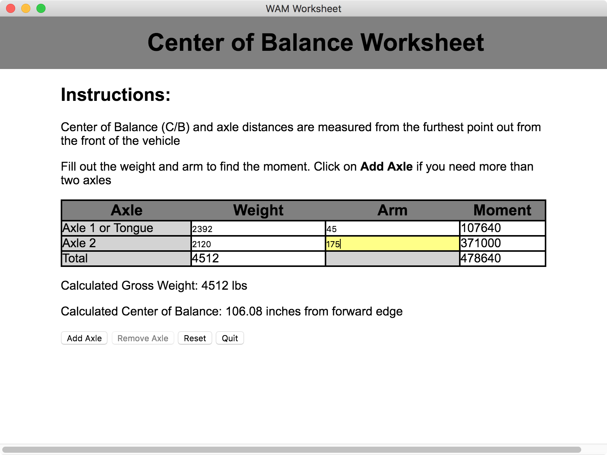

# WAM Worksheet



This app is a basic WAM sheet used by aircraft cargo loaders to load rolling stock onto aircraft.  Determining the precise center of balance is a vital, and yet tedious, job of number crunching.  We need to know the center of balance, in inches from the forward edge of the vehicle so that we can know where to place the vehicle in the aircraft safely.

This is done by taking the weights and arms of each axle and multiplying them together to get the moment.  The weight is acquired by simply driving the vehicle so its tires are over a scale, reading the scales and adding the weights, repeating for each axle.  The arm is simply the distance of the axle from the forward edge.

Once we have the weights and moments of each axle, we can go ahead and add it all up, then we divide the total moment from the total weight and we get our center of balance distance.

# Usage

This app is made in Electron and Vue.  I don't have a built app ready for download, but the scripts are available in the `package.json.`

Simply run whichever of the following matches your OS:
```bash
npm run package-mac
npm run package-win
npm run package-linux
```

# License

This is under the MIT license.